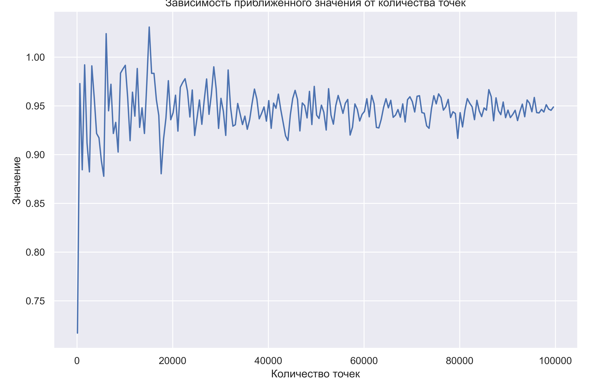

# SET-3. Аналитика.
Выполнил: Юнда Степан Владимирович, БПИ 235

## Задача А1. Задача трёх кругов.

ID посылку A1i в CodeForces: `292999790`
Ссылка на публичный репозиторий: https://github.com/MrStepWay/DSA_SET3_A1

### Графики для большей прямоугольной области

**График 1-ого типа зависимости приближённого значения площади от количества сгенирированных точек.**

**График 2-ого типа зависимости относительного отклонения приближённого значения площади от её точной оценки от количества сгенирированных точек.**

На графиках наглядно отображено, как по мере увеличения количества сгенерированных точек, приблежённое значение площади пересечения трёх окружностей приближается к её точной оценке (отклонение приблежённого значения от точной оценки уменьшается). При увеличении количества сгенерированных точек приближённое значение становится более точным и более устойчивым, то есть колебания становятся меньше. Это значит, что при большем количестве точек мы получим более точную оценку с большей вероятностью.
Это логично, поскольку при большем количсетве точек, больше точек попадает в интересующую нас область пересечения трёх окружностей вместе с увеличением их общего числа, значит отношение $\frac{M}{N}$ становится ближе к $\frac{S}{S_{rec}}$, где 
- $N\quad$ — общее число сгенерированных точек в рассматриваемой прямоугольной области.
- $M\quad$ — число точек, которые попадают внутрь и на границу фигуры пересечения трех кругов.
- $S\quad$ — площадь пересечения трёх окружностей.
- $S_{rec}$ — площадь рассматриваемой прямоугольной области (константа).

Таким образом, большее количество сгенерированных точек позволяет нам получить более точную оценку с большей вероятностью.

### Графики для маньшей прямоугольной области

**График 1-ого типа зависимости приближённого значения площади от количества сгенирированных точек.**

**График 2-ого типа зависимости относительного отклонения приближённого значения площади от её точной оценки от количества сгенирированных точек.**

Все рассуждения для большей прямоугольной области применими и к меньшей прямоугольной области.

### Сравнение результатов для большей и меньшей областей

Как мы видим, использование меньшей прямоугольной области даёт более точную и устойчивую оценку при меньшем количестве точек, по сравнению с большей областью. Вероятность попасть в интересующую нас область при генерации точек в меньшей области выше, поскольку отношение $\frac{S}{S_{rec}}$ (фактически, это отношение характеризует вероятность попасть в область пересечению трёх окружностей) больше, что позволяет дать более точную оценку.

Получается, лучше применять настолько маленькую прямоугольную область, насколько это возможно (но в неё должна полностью входить интересующая нас область). Это позволяет с некоторой точностью вычислить площадь с наименьшими затратами при прочих равных, по сравнению с большими прямоугольными областями, или же получить более точную оценку с большей вероятностью при равном количестве сгенерированны точек.